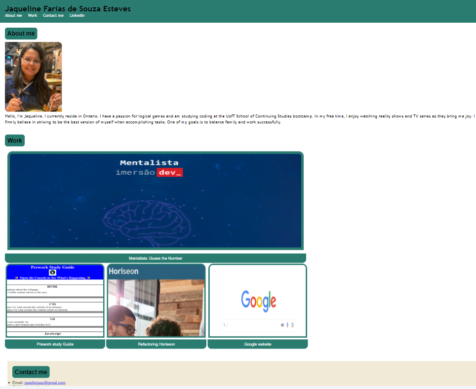

# Jaqueline Esteves Portfolio

## Description

This project was a great adding to my experience in HTML and CSS, it is my first time trying to build a page from zero. I have used more than 16 hours trying to figure out how to build this simple structure, it was important for me.
I practiced how to add links, add images, about hover, media query, about ID and class, how to use cards and variables.

## Usage
It is possible to click in the 'nav' bar to go to the about me, my work, contact and my linkedin. There's a link to my first application, and a link to my git hub in contacts.

--The google page isn't part of my Work, but I added beacuse I don't have lots of works, and my phone number is not correct.

    

## Credits

I had some help from the lectures, xpert learning, w3 schools, MDN web and google.

some links that helped me:

-https://css-tricks.com/snippets/css/a-guide-to-flexbox/

-https://www.w3schools.com/html/html_links.asp

-https://www.w3schools.com/howto/howto_css_image_overlay.asp

-https://stackoverflow.com/questions/53530937/how-can-i-make-an-image-fade-into-color-upon-hover

-https://developer.mozilla.org/en-US/

## Deployed page
https://jaquelineesteves.github.io/My-portfolio/

## Repository:
https://github.com/jaquelineesteves/My-portfolio.git
